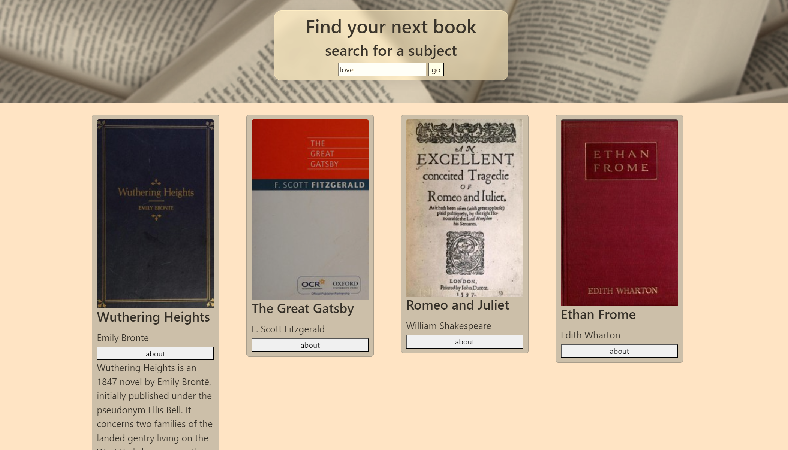

# open library project: FIND YOUR BOOK

---

## Link :
[find your book](https://pixinini.github.io/open-library-project/)

## Languages and tools:

HTML, CSS, BOOTSTRAP, JS, WEBPACK

## How to use:

What should you read next? Simply search for a subject and press GO!; Open library API can help you recommend some books. You can also find some info about, if you click the button. 

## getData()
This is the function where the data from API are fetched. As you can see, I used axios for this function. First of all, it's important to declare the sucsessful and error status from the web API (with 'if' statement). Then we can proceed to get the data from API, based on what we write on the search bar. In this project you can get title, author, cover and description of a book (when it is possible).
Finally, with a for loop we can get a card (made with bootstrap) for every books fetched.

